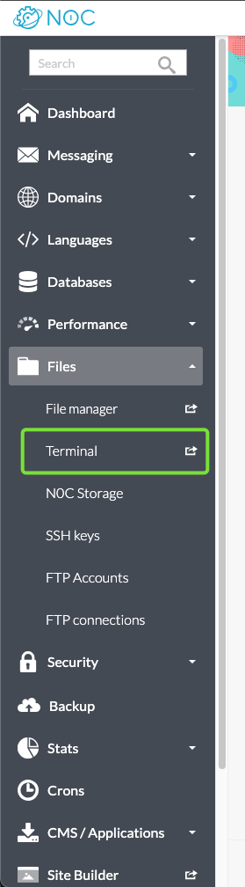
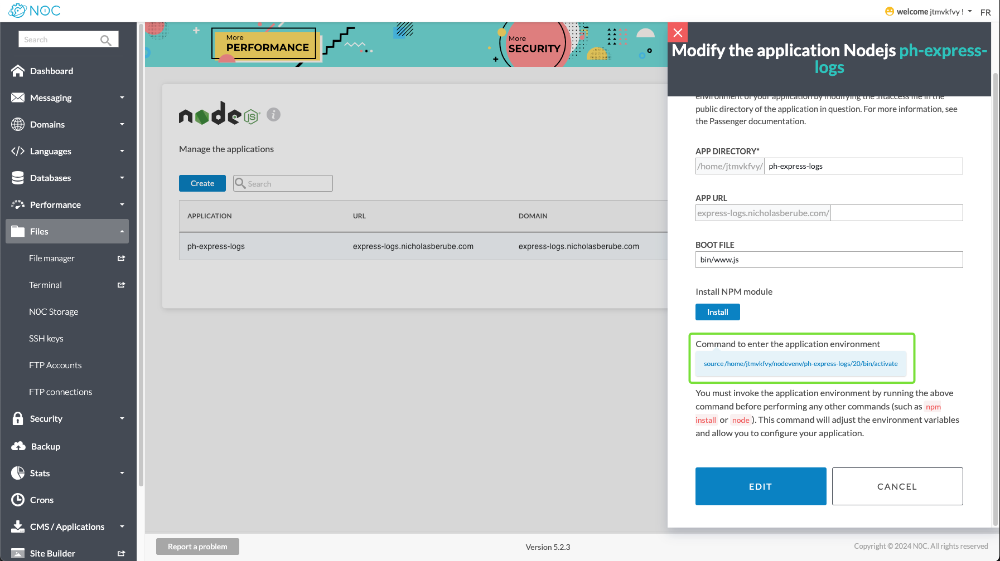
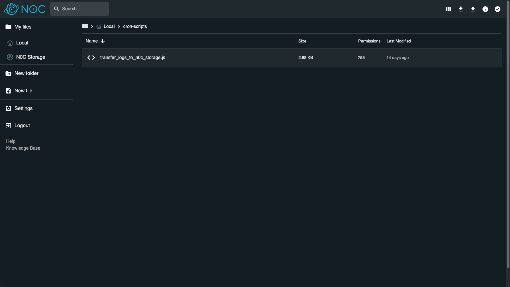
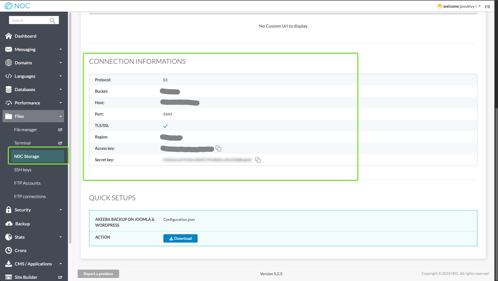
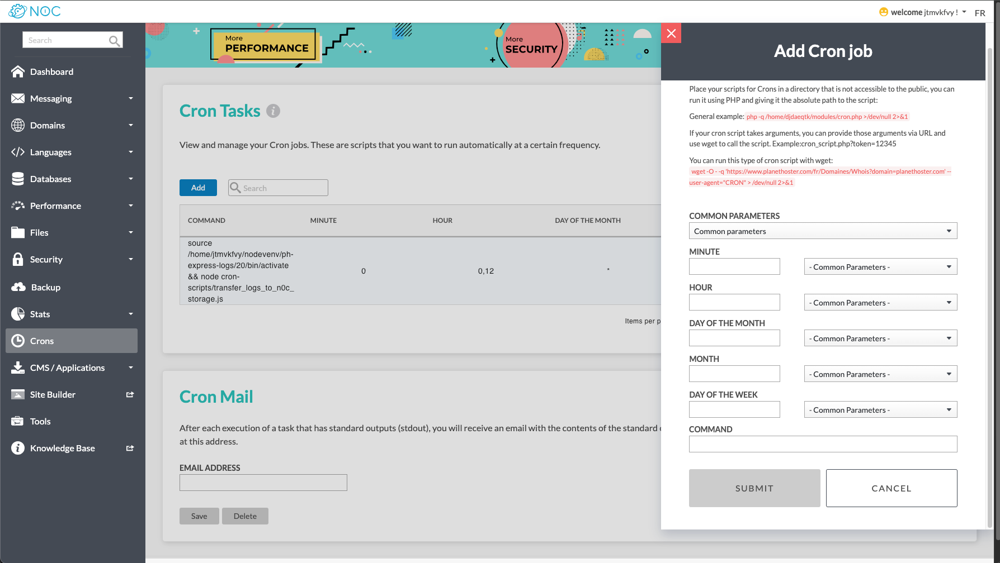
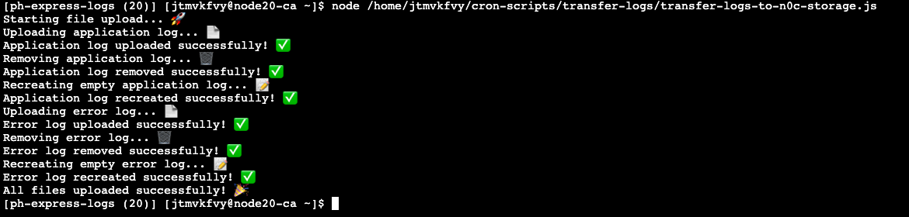

# Transfer Logs To N0C Storage

This is a JavaScript script that can be used to transfer logs from your server to N0C Storage.

Consequently, this allows you to save space and avoid cluttering your SSD, while still keeping your logs accessible.

This script can be used as a starting point to create more complex scripts or integrated directly into an application.

In this example, we set up a cron job to run the script twice a day.


### What is N0C Storage?

N0C Storage is a platform designed to store massive files such as backups,
archives and items that do not require a high-performance disk (SSD).

[Learn more about N0C Storage](https://kb.n0c.com/en/knowledge-base/how-to-use-n0c-storage/)

## Requirements

- Node.js application on your server which generates logs
- S3 JavaScript SDK (e.g. [minio](https://github.com/minio/minio-js))
- Dotenv package (e.g. [dotenv](https://www.npmjs.com/package/dotenv))
- SSH access to your server [Learn more](https://kb.n0c.com/en/knowledge-base/how-to-create-an-ssh-key-and-connect-to-an-account/)

## Installation

**Note:** Replace `username` with your server username and `myapp` with your application name.

1. SSH into your server or alternatively use N0C Terminal

   

2. Source the application environment
   ```bash
   source /home/username/nodevenv/myapp/20/bin/activate
   ```
   
   The command to source the environment may vary depending on the application and the environment name.

   You can find the correct command in the application tab.

   
3. Install the required packages
   ```bash
   npm install minio dotenv
   ```
   
   If you are using a different S3 SDK, replace `minio` with the correct package name.
4. Create a folder for the script

   ```bash
   mkdir /home/username/cron-scripts/transfer-logs/
   ```
   
5. Create a new file in the folder
   ```bash
   touch /home/username/cron-scripts/transfer-logs/transfer-logs-to-n0c-storage.js
   ```
6. Copy the script content from the repository to the file
   ```bash
   nano /home/username/cron-scripts/transfer-logs/transfer-logs-to-n0c-storage.js
   ```
   Paste the content and save the file.

   **Note:** Alternatively, steps 4-6 can be done via N0C's file manager.

   
7. Create a `.env` file in the same folder
   ```bash
   touch /home/username/cron-scripts/transfer-logs/.env
   ```
   
8. Add the following content to the `.env` file, replacing the placeholders with your data
   ```bash
   S3_BUCKET=bucketname
   S3_HOST=hostname
   S3_PORT=port
   S3_ACCESS_KEY=accesskey
   S3_SECRET_KEY=secretkey
   S3_SSL=true
   
   PATH_TO_LOGS=your-log-path
   APPLICATION_LOG_FILENAME=your-log-filename
   ERROR_LOG_FILENAME=your-error-log-filename
   
   N0C_STORAGE_LOG_PATH=your-n0c-storage-path
   ```
   
   **Note:** Your N0C Storage credentials can be found here:
   
9. Create the cron job via the interface
   
   

   In the command field, add the following command:
   ```bash
   source /home/username/nodevenv/myapp/20/bin/activate && node /home/username/cron-scripts/transfer-logs/transfer-logs-to-n0c-storage.js
   ```
   
   To run the script twice a day, select twice a day in the common parameters field

Done! Your logs will now be transferred to N0C Storage twice a day.

## Running the script manually

To run the script manually:

1. SSH into your server or alternatively use N0C Terminal
2. Source the application environment
   ```bash
   source /home/username/nodevenv/myapp/20/bin/activate
   ```
3. Run the script
   ```bash
   node /home/username/cron-scripts/transfer-logs/transfer-logs-to-n0c-storage.js
   ```
   
   
